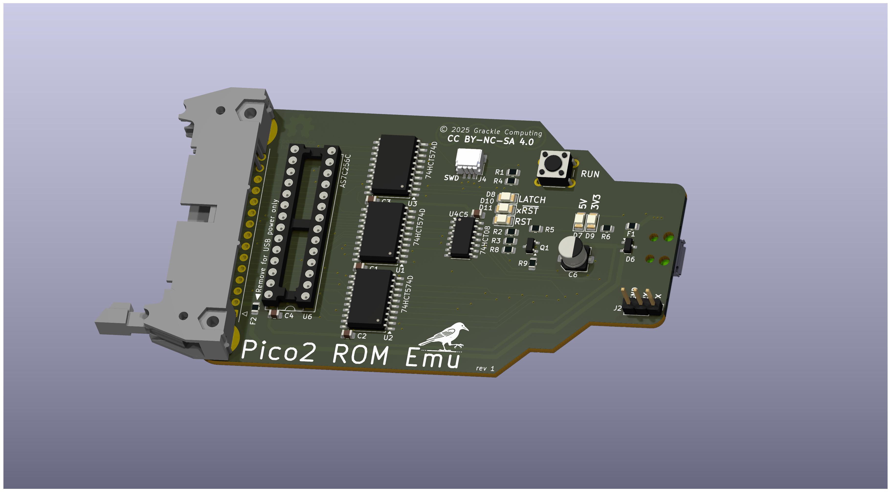
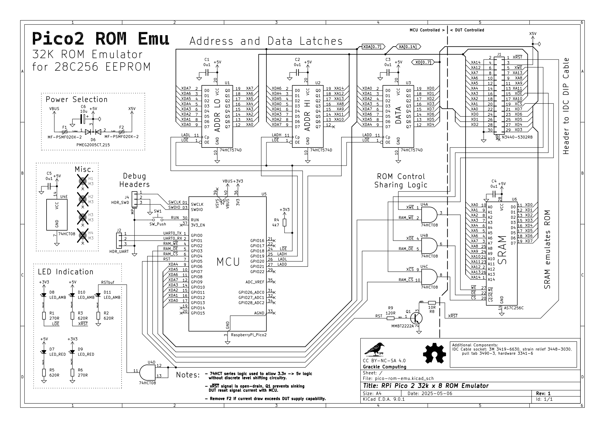

# Pico2-ROM-Emu

Pico2-ROM-Emu is a project designed to emulate 28 pin EEPROM (28C256 compatible) functionality using the Raspberry Pi Pico2 and a fast SRAM.

## Theory of Operation
The theory of operation is relatively simple:

1. Assert active-low reset signal
2. Fill SRAM with ROM data using octal latches 
3. Hi-Z the latches and de-assert reset
4. SRAM is directly connected to DUT EEPROM socket via ribbon cable 

## Circuit Schematic

## MicroPython Firmware (`pico-rom-emu-firmware`)
This sub-project contains the firmware written in MicroPython. It is responsible for:
- Copying provided ROM binary images to the embedded SRAM
- Accepting new ROM images over USB serial connection
- Controlling DUT reset signal
